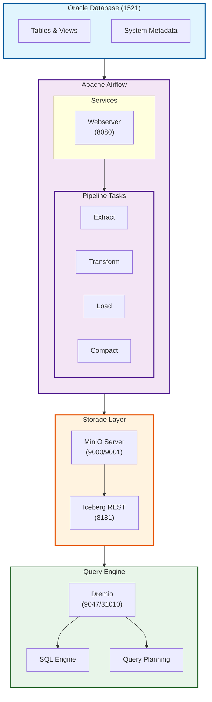
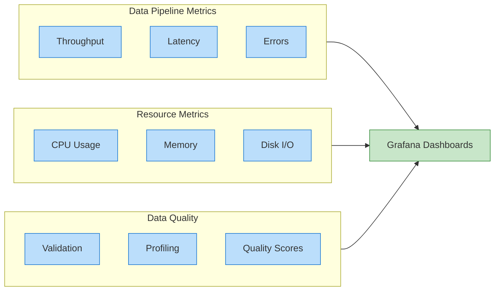

# Oracle2Lakehouse-Batch

A robust data pipeline for efficiently transferring data from Oracle databases to a data lakehouse using Apache Airflow.

## 📖 Overview

This project provides an automated solution for synchronizing data between Oracle databases and a data lakehouse built on MinIO (S3-compatible storage). It supports both full and incremental data loads, with built-in data quality checks and audit logging.

### Key Features
- 🔄 Dynamic DAG generation from YAML configurations
- 📊 Support for both full and incremental data loads
- 🔍 Integrated data quality validation
- 📝 Comprehensive audit logging
- 🚀 Optimized for performance with data compaction
- 🔒 Secure credential management

## 🏗 Architecture

### Component Overview


The diagram shows the main components and their default ports:
- Oracle Database: Listens on port 1521
- Airflow Webserver: UI access on port 8080
- Airflow Scheduler: Internal port 8793
- Redis: Cache service on port 6379
- MinIO: S3-compatible storage on ports 9000 (API) and 9001 (Console)
- Iceberg REST: Table metadata service on port 8181
- Dremio: SQL engine on port 9047 (UI) and 31010 (Client)

### Data Flow
1. **Configuration**: YAML files define table synchronization settings
2. **Extraction**: Data is pulled from Oracle using optimized queries
3. **Transformation**: Data is converted to Apache Iceberg table format
4. **Validation**: Quality checks are performed
5. **Loading**: Data is stored in MinIO with proper partitioning
6. **Compaction**: Small files are automatically compacted for better performance
7. **Auditing**: Comprehensive logs are maintained
8. **Query Access**: Dremio provides SQL query capabilities over the data lake

## 🚀 Quick Setup

1. Clone the repository:
```bash
git clone https://github.com/AlirezaHanifi/Oracle2Lakehouse-Batch.git
cd Oracle2Lakehouse-Batch
```

2. Configure environment:
```bash
cp .env.example .env
# Edit .env with your settings
```

3. Start services:
```bash
./manage.sh up
```

## 🔧 Configuration

### Table Specification Example
```yaml
table_id: "bank.employees"
sync_mode: "incremental"
schedule: "@daily"
incremental_key: "last_update_ts"
drop_columns:
  - "sensitive_data"
partition_by:
  - "department_id"
  - "last_update_ts"
enable_compaction: true
file_size_target_mb: 512
```

### Available Settings
- `table_id`: Schema and table name (format: "schema.table")
- `sync_mode`: "full" or "incremental"
- `schedule`: Airflow cron expression
- `incremental_key`: Column for incremental loads
- `drop_columns`: Columns to exclude
- `partition_by`: List of columns to partition the Iceberg table by
- `enable_compaction`: Whether to run compaction after sync (default: true)
- `file_size_target_mb`: Target file size for compaction in MB (default: 512)

## 📁 Project Structure
```
oracle2lakehouse-batch/
├── src/
│   ├── dags/                  # Airflow DAGs
│   │   ├── dag_factory.py    # DAG generator
│   │   └── include/
│   │       ├── utils/        # Shared utilities
│   │       └── table_specs/  # Table configurations
│   └── sql/                  # SQL scripts
├── docker/                   # Docker configurations
└── manage.sh                 # Management script
```

## 🛠 Implementation Details

### DAG Generation
- DAGs are dynamically generated from YAML configurations
- Each table gets its own DAG with appropriate settings
- Branch operators determine sync mode at runtime

### Data Synchronization
1. **Full Load**:
   - Extracts all data from source table
   - Overwrites destination file
   - Creates audit record

2. **Incremental Load**:
   - Uses timestamp-based filtering
   - Appends new data to partitioned structure
   - Maintains audit trail

### Data Storage
- Data is stored in Apache Iceberg table format
- Tables support schema evolution and time travel
- Files are organized by schema/table with optimized metadata
- Automatic compaction of small files for better query performance
- Partitioning based on sync timestamps
- Audit logs track all operations
- Dremio provides SQL query interface with push-down optimization

## � Monitoring & Observability

### Metrics & Dashboards


### Troubleshooting Guide

#### Common Issues and Solutions
1. **Connection Issues**
   - Check network connectivity
   - Verify service health
   - Validate credentials

2. **Performance Problems**
   - Monitor file sizes
   - Review query patterns
   - Check resource usage

3. **Data Quality Issues**
   - Validate schema changes
   - Check transformation rules
   - Review error logs

## �🔜 Future Work

### 1. Performance Optimization
- [ ] Implement data compaction for small files
- [ ] Add parallel processing for large tables
- [ ] Optimize Parquet file settings

### 2. Data Quality
- [ ] Integrate Great Expectations
- [ ] Add schema validation
- [ ] Implement data profiling

### 3. Monitoring & Observability
- [ ] Add Prometheus metrics
- [ ] Create Grafana dashboards
- [ ] Implement alerting system

### 4. Security Enhancements
- [ ] Integrate with HashiCorp Vault
- [ ] Add column-level encryption
- [ ] Implement role-based access control

### 5. Feature Additions
- [ ] Support for CDC (Change Data Capture)
- [ ] Add data masking capabilities
- [ ] Implement data retention policies
- [ ] Add support for Delta Lake format
- [ ] Create web UI for configuration management

## 🤝 Contributing
Contributions are welcome! Please read our contributing guidelines and submit pull requests to our GitHub repository.

## 📝 License
This project is licensed under the MIT License - see the LICENSE file for details.
